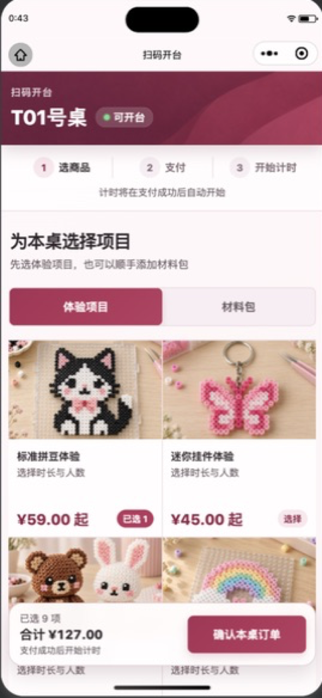
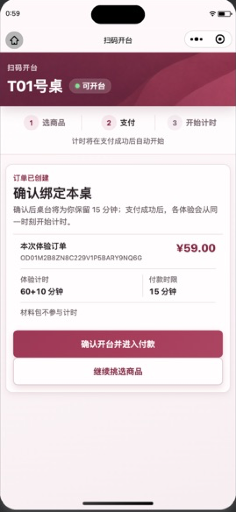
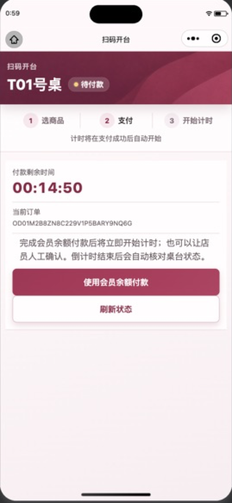
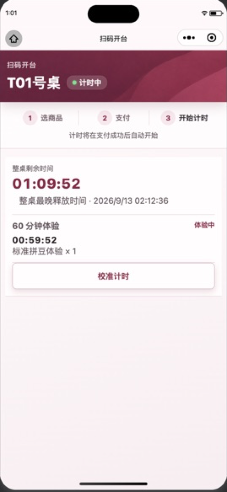
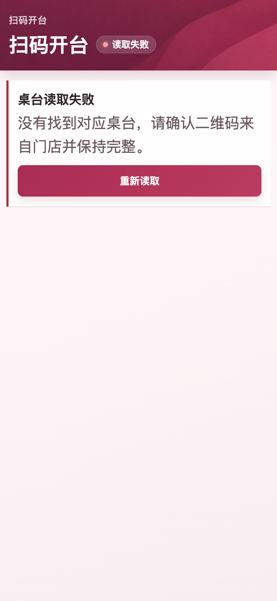

# Ribbon Ledger 管理与顾客界面统一：Design QA

## Findings

- 当前没有仍需处理的 P0、P1 或 P2 视觉、交互、响应式或角色分流问题。
- 工作台“进入”反馈已收敛到胶囊本身：完整动作行继续承担触控，但自定义小程序 `hoverClass` 只让“进入”胶囊轻微收紧并加深，行背景与左右文案完全不变。导航处理中也只让当前胶囊进入柔和禁用视觉，其余五项保持正常亮度；并发导航仍由独立引用锁拦截。
- 工作台页头已使用真实的深莓分块纹理位图；三个账簿分组的顶部与左侧装饰由同一强调色基底连续形成，用户指出的圆角转角不连贯已消除。
- 工作台之外的 17 个 ADMIN+ 页面已复用同一张真实深莓分块纹理：列表／设置与表单放在任务页头，详情／配置放在对象身份区；各页只按标题调整取景，正文和高密度数据保持瓷白实色。业务状态与危险动作仍保留原语义。
- 管理预约页实屏已将顶部双按钮改为唯一的右上角“店铺工作台”小按钮；“店休设置”作为页头下方营业日历关联卡片呈现。店休页使用对称结构，顶部同样不会出现两个按钮。
- 顾客的商城、预约、订单、会员中心及其商品、购物车、订单、预约和钱包二级流程已接入同一纹理身份区与克制的瓷白块强调带；登录主按钮不再使用 Taro 原生 `primary` 类型，按压态保持莓果色而不会变绿。
- [P3] 发布前仍需使用真实 ADMIN 后端数据执行完整任务流，并在 iOS VoiceOver 与 Android TalkBack 真机检查焦点顺序、朗读和返回后的焦点恢复。这不阻断本轮样式与交互修复，但不能据此宣称真机辅助技术发布验收已完成。

## Comparison Targets

- 用户的纹理页头参考：会话附件 `codex-clipboard-4f3fe588-c363-45e8-8422-ddcda501eb08.png`（不入库）。
- 用户的 L 形转角问题参考：会话附件 `codex-clipboard-8f4d58c6-c1f7-49a7-91a8-ade80e7d2d52.png`（不入库）。
- 用户本轮确认的通用纹理参考：会话附件 `codex-clipboard-85317690-dc92-4002-b107-98bbbfe0866d.png`（不入库）。
- 用户本轮指出的预约页头双按钮参考：会话附件 `codex-clipboard-110bf230-6338-4362-a8d3-6538be79e60e.png`（不入库）。
- 用户确认的 Option 2 视觉源图：会话生成预览，`853 × 1844 px`（不入库）。
- 本轮生成的无文字纹理源图：会话生成源图，`2170 × 725 px`（仅提交下述压缩生产资产）。
- 项目生产纹理资产：`miniapp/src/assets/admin/workbench-header-texture.jpg`，`1500 × 501 px`，`86,761` bytes。
- 最终微信工作台首屏：`docs/08_frontend/qa/admin-workbench-production.png`，`602 × 1306 px`。
- 最终工作台转角局部：`docs/08_frontend/qa/admin-workbench-corner-production.png`，`300 × 230 px`。
- 最终微信工作台底部：`docs/08_frontend/qa/admin-workbench-production-bottom.png`，`602 × 1306 px`。
- 本轮微信管理预约实屏：`docs/08_frontend/qa/admin-reservations-texture-production.jpg`，`272 × 588 px`；同时保留 `docs/08_frontend/qa/admin-reservations-texture-production-full.jpg` 的完整工具窗口取证。

## Same-input Comparison Evidence

- 最终一轮把用户的通用纹理参考、修改前预约页头双按钮参考与当前微信管理预约实屏放入同一比较输入；此前工作台纹理、转角参考与最终工作台首屏／转角局部也保留同输入对照，不以分别查看图片代替视觉判断。
- Full-view 对照确认页头已经呈现与参考同方向的分块渐变纹理，同时白色标题、品牌、身份和副标题在深莓背景上保持清楚；纹理没有包含虚构品牌元素、文字或人物。
- Focused-region 对照确认三个分组的强调色从顶部自然转入标题区左侧，圆角附近没有双线、缺口或拼接错位。实现使用同一强调色基底和裁切容器，而不是把顶边与左边作为两条独立边框。
- 管理预约对照确认真实分块纹理已经进入二级页头，右上角只有一个紧凑工作台入口；营业日历互跳卡片与筛选区形成清楚的纵向层级，不再在深色页头中堆叠两个大按钮。
- 工作台的三组信息架构、六条路由、整行触控、无顾客底栏和 Option 2 的阅读节奏保持不变。

## Interaction Evidence

- 每个工作入口仍由一个完整宽度的 Button 承担交互，“进入”胶囊只是去向提示，不是嵌套按钮。
- `activeActionUrl` 只匹配当前动作 URL；每行显式使用 `hoverClass='workbench-action--pressed'`，按压样式只落到 `.workbench-action__enter`。导航中不再给完整动作行设置原生 `disabled`，只有当前动作获得 `workbench-action--pending`，且该状态仅改变右侧胶囊。其余动作行、当前行白底及左侧文案保持正常亮度。
- `actionNavigationRef` 在导航调用前同步加锁，在完成或失败后释放；其他视觉正常的入口在原生导航在途时不会发起并发跳转。
- Jest 回归覆盖六行都使用局部按压类、导航中完整动作行始终没有原生 `disabled`、pending 状态只落在当前入口胶囊，以及预约／店休页头各只有一个工作台入口并把互跳按钮放在关联卡片中。
- 登录按钮回归确认 DOM 不再携带 `type='primary'`，而是使用 `login-form__submit--pressed` 莓果按压类，避免微信原生绿色反馈。
- 导航失败仍保留明确错误与重试能力；权限、角色分流、退出和六条目标路径没有变化。

## Admin Surface Coverage

- 列表和设置：订单、商品、预约、用户、店休日、商品操作历史、全局库存流水采用真实深莓纹理页头、白色标题和瓷白筛选／摘要面板。
- 详情和配置：订单详情、商品详情、预约详情、商品配置、商品图片、商品库存把相同纹理用于身份／摘要面板，保持对象、状态和关键数字优先。
- 表单：商品创建与编辑共用 `admin/styles/product-form.scss`，在统一页头下用顶部强调线组织可编辑区。
- 资金与权限：用户钱包与钱包订单使用权威信息面板突出余额、资金后果和管理员操作边界。
- 同一真实纹理仅复用于每页顶部身份区，并通过 `background-position` 适配标题；订单、库存、审计、权限、错误与危险操作仍在高对比实色面板中，不被纹理覆盖。
- 全部 18 个 ADMIN+ 页面仍是无底栏页面；没有新增页面、路由、统计接口、假数字或管理员 TabBar。

## Customer Surface Coverage

- 四个根页的任务页头复用真实深莓纹理，底部仍保持已确认的瓷白丝带托盘，信息架构、选中同步和安全区结构不变。
- 商品详情、购物车、下单确认、订单详情、预约创建／详情、钱包充值／流水使用同一纹理身份区；真实商品图仍在内容区，业务状态与金额继续优先。
- 筛选、表单、摘要与记录块通过内嵌强调带增加分块节奏；强调带随圆角裁切，不再使用可能在转角断开的独立粗边框。
- 登录卡片结构未改，只替换主按钮的原生绿色按压来源；密码、微信两种认证模式都使用同一莓果反馈。

## Fidelity and Accessibility Review

- Typography: 沿用项目系统中文字体栈；标题、正文、辅助文案和表格数字层级不变，长 ID 继续安全换行。
- Color and contrast: 深莓页头使用白色主文案，瓷白面板使用莓墨正文。分组强调色只建立扫描节奏，不表达状态、优先级、风险或权限。
- Semantic colors: 成功、警告、危险、禁用、业务状态和权限提示继续使用既有文字与语义色，不只依赖品牌色。
- Assets: 页头使用真实本地 JPEG；来源与使用边界记录在 `miniapp/src/assets/admin/README.md`。没有 emoji、手绘 SVG、CSS 图案、占位图或第三方品牌资产。
- Touch and focus: 工作台整行动作保持移动端触控高度和可见名称；二级页面既有 Button、Input 和错误语义未被纯样式改造替换。
- Responsive: 工作台手机单列、`768px` 起同组双列；共享 Surface 只调整视觉层级，不改变既有页面布局断点和业务结构。

## Verification Summary

- Workbench targeted Jest: `1 suite / 10 tests` passed；只保留测试工具链既有 React `act` 弃用提示。
- Full miniapp Jest: `96 suites / 702 tests` passed；只保留测试工具链既有 React `act` 弃用提示。
- TypeScript `tsc --noEmit`: passed。
- ESLint: passed，`0 error / 0 warning`。
- Stylelint: passed。
- 用户已有微信开发者工具 watcher 已重新输出全部 18 个 ADMIN+ 页面及 12 个顾客业务页面的 WXSS；这些产物都包含内联真实 JPEG 数据，证明共享纹理资产进入微信样式编译链。登录产物包含自定义莓果按压类且不再出现旧微信绿色色值。
- 微信开发者工具 Stable `2.02.2608060` / 基础库 `3.17.2` 已真实打开管理预约页，并使用本地 ADMIN 演示数据验证纹理页头、唯一右上角工作台入口、营业日历关联卡片、筛选和首屏记录。本轮没有切换当前管理员会话去冒充普通 USER 实屏；顾客侧本次以组件回归、类型／静态检查及 12 个微信 WXSS 实际编译产物为验证范围，真机顾客视觉仍留给发布前验收。
- 后端、OpenAPI、数据库、迁移、依赖与应用版本均未改变；后端完整回归保持本次纯前端调整前的 `2351 passed, 33 skipped`。

## Implementation Checklist

- [x] 页头使用真实分块纹理位图并保留深莓渐变回退。
- [x] 三个分组使用连续 L 形强调色基底，修复圆角转角不连贯。
- [x] “进入”按压与导航反馈只落在当前胶囊，整行背景、文字和其余条目保持正常。
- [x] 保留并发导航锁、六条原路由、整行触控、错误恢复和角色权限边界。
- [x] 将真实纹理统一到其余 17 个 ADMIN+ 页面，并把管理预约／店休页头收敛为单一小入口。
- [x] 将同一纹理和圆角连续强调带扩展到顾客根页及二级流程，移除登录原生绿色按压态。
- [x] 完成工作台专项、完整 Jest、TypeScript、ESLint、Stylelint 和微信样式产物检查。
- [x] 同步 Surface、`DESIGN.md`、可渲染设计 sidecar、前端架构与 changelog。
- [ ] 发布前完成真实 ADMIN 数据任务流和 iOS/Android 真机读屏专项验收。

## 扫码开台：Option 3 商品优先流程 + Option 1 “可开台”状态

验收日期：2026-09-13

验收设备：微信开发者工具 Stable 2.02.2608060 / 基础库 3.17.2 / iPhone 15 Pro Max 视口，按 390 × 844、2× 输出检查

验收数据：本地隔离 SQLite；T01；普通合成顾客；1 件 60 分钟体验商品；本地钱包支付

### 同输入目标与实际

| 选定的 Product Design 方向 | 微信开发者工具实际渲染 |
| --- | --- |
|  |  |

本轮把目标图与实现截图放在同一比较输入中完成 full-view 与 focused-region 检查。实际实现保留了 Option 3 的莓红纹理页头、桌号主层级、三步旅程、双列商品目录和固定结算栏，并完整结合 Option 1 的绿色圆点与半透明“可开台”胶囊。桌号、状态与步骤没有被微信原生导航栏挤压或截断。

目录截图保留了进入真实流程前的本地种子购物车，用于验证多商品与较大合计金额时底栏仍稳定；完整开台测试前已通过用户界面清理为 1 件有效体验商品，没有绕过订单校验。

### 有意偏差

- 商品卡进入真实详情页选择时长、人数或 Kit 颜色/重量，而不是复制概念图中无法表达配置的加减按钮。
- 底栏使用“确认本桌订单”，没有使用概念图中过早承诺扣款的“确认并支付”；实际顺序是创建订单、绑定桌台、付款、开始计时。
- 三个步骤之间使用细分隔线而不是箭头，在小程序窄屏下更安静，也不会削弱顺序关系。
- 商品图片、名称与价格来自隔离后端的实际数据；本地 HTTP 图片通过微信开发环境专用下载桥转换为临时文件，网络响应为 200，线上 HTTPS 与 H5 路径不受影响。

### 完整状态证据

| 已创建订单、待绑定 | 已绑定、待付款 | 支付成功、计时中 |
| --- | --- | --- |
|  |  |  |

实际链路按以下顺序完成：

1. T01 解析为已启用且可用；页面立即呈现商品目录，不要求用户预先在商城建单。
2. 用户在商品详情选择“标准拼豆体验 / 60 分钟 / 1 人 / 工作日”，回到扫码页后点击“确认本桌订单”。
3. 订单创建成功后自动返回 T01，并只聚焦这次扫码 handoff 对应的新订单。
4. 用户确认绑定桌台；服务端创建 `awaiting_payment` 会话并给出 15 分钟付款倒计时，此时数据库没有计时器。
5. 第一次余额支付被“余额不足”正确阻止，会话仍为待付款且没有提前计时。随后只在隔离数据库中通过既有钱包调账业务给合成账号加入 100 元测试余额。
6. 第二次从用户界面支付 59 元成功。订单进入已支付、Payment 进入 succeeded、会话进入 active，并创建唯一的 60 分钟体验计时器和 10 分钟缓冲时间。
7. 数据库中 Payment `succeeded_at`、Session `started_at`、Timer `started_at` 三者完全相同，证明计时起点由支付成功事件统一触发，而不是扫码、选商品、创建订单或绑定桌台时提前触发；钱包余额为 41 元。

桌台对账结果为 `open_sessions=1 / occupancies=1 / awaiting_with_timers=0 / active_without_timers=0 / violations=0`。钱包对账结果为 `scanned=11 / mismatches=0 / violations=0`；SQLite `quick_check=ok` 且外键违规为 0。

### 失败与恢复状态

- “读取失败”复用同一页头、状态胶囊、内容票据与主操作层级；后端英文错误不会直接暴露给顾客，而是转换为中文可执行说明。
- 目录加载失败、聚焦新订单暂未出现在 eligible 列表、开台结果未知、支付结果未知、桌台使用中、会话已结束均有独立文案和安全恢复动作。
- 聚焦订单暂时缺失时不再静默回到目录，避免用户重复下单；可选择重新读取或查看订单。
- 只有这次扫码 handoff 对应的新订单 claim 成功后才精确清除本地意图；普通商城订单、直接选择旧订单、异用户、过期或已被新扫码替换的意图都不会误消费或误删除桌台上下文。

### 排版、居中与无障碍检查

- 页头以 `T01号桌` 为主标题，“扫码开台”为眉题；状态圆点旁同时显示文字，不只依赖颜色表达状态。
- 分类按钮、结算主按钮、“重新读取”“确认开台并进入付款”“使用会员余额付款”和“校准计时”均由统一 flex 控件实现，固定控制高度并使用双轴居中；实机截图中未发现文字基线偏上或偏下。
- 三步旅程为等宽三列，编号与文字成组居中；当前、已完成和未开始状态分别提供读屏标签，不只靠颜色区分。
- 商品分类使用 `tablist` / `tab` 语义并提供当前分类名称；商品卡读屏名称包含商品名、价格、配置要求和已选数量。
- 常规正文和按钮文字对比度均达到 4.5:1 目标；可见主操作和商品卡触控区不小于 44px。
- 微信开发者工具控制台在成功链路中没有应用异常；可见的合法域名关闭提示与两个 preload 提示来自本地开发工具环境。第一次余额不足对应预期业务错误，补入隔离测试余额后同一界面操作成功。
- 320px 极窄屏、系统 200% 大字号、iOS VoiceOver 与 Android TalkBack 仍属于发布前真机专项，不在本地模拟器证据范围内。

### 验证汇总

- 扫码页专项 Jest：`1 suite / 16 tests` passed。
- 小程序完整 Jest：`103 suites / 752 tests` passed。
- TypeScript `tsc --noEmit`：passed。
- ESLint：passed，0 warning。
- Stylelint：passed。
- `git diff --check`：passed。
- 微信开发者工具实操：扫码进入、选择商品、创建订单、绑定桌台、余额不足拦截、余额支付成功、统一启动计时全部完成。
- 本轮使用的是本地普通桌台二维码内容与内部钱包支付；没有生成微信官方小程序码，也没有连接真实微信支付、共享、预发布或生产环境。

P0：0；P1：0；P2：0。视觉审查中发现的 Tab 角色、当前步骤读屏提示和商品卡完整读屏名称三个 P2 均已修复并加入回归断言。

final result: passed

## 2026-09-13 · 新建预约与可选完整套餐

### 范围与结论

使用 Product Design 的现有设计实现与 design-qa 流程，沿用项目 Ribbon Ledger；本轮不另创视觉方向。**本地 H5 核心交互与布局通过；真实商品照片保真、微信开发者工具／真机视觉验收待复核。** 本次证据不能替代发布验收或数据库迁移证据。

- 参照：`design-qa-assets/table-entry-option3-catalog-mobile.png`，现有扫码开台微信截图，780 × 1688 px，含设备框和原生导航。
- 新建页：`design-qa-assets/reservation-create-mobile.png`，390 × 844 CSS px、deviceScaleFactor=2，780 × 1688 px，H5 内容截图，无设备框。两图在同一比较输入检查；比较内容区的文字层级、莓红纹理、暖白表面、分隔与双列商品卡，不把原生导航、设备框和视口高度差异当作设计偏差。
- 已额外查看套餐局部 `reservation-packages-focus.png`，以辨认名称、价格、选填说明和时长／人数完整规格。响应式检查覆盖 320、390、768、1280 CSS px，窄屏无横向溢出；宽屏时间和联系方式并列，套餐独占下一行。
- 合成账号、套餐、预约与故障注入均位于一次性 SQLite + 内存 Redis 环境。没有调用持久数据库或真实支付。

### 已修正的发现

| 级别 | 位置与影响 | 修正与复核 |
| --- | --- | --- |
| P1 | 列表创建按钮、套餐展开按钮继承 H5 全宽，挤压标题成为竖排 | 局部显式 `width: auto`；390 和 320 宽度复核可读 |
| P1 | Taro H5 的 `disabled="false"` 被禁用样式命中，使可操作按钮变灰、商品名称发白 | 本次创建页／套餐选择器在可用时省略 disabled 属性；实测主按钮 opacity=1、白字，商品名称为 `rgb(45,36,41)`；真正禁用时仍传 true |
| P2 | 宽屏沿用旧网格造成时间／联系电话各占一行半宽，出现大块空白 | 将时间与联系方式放在同一网格行，套餐置于其后 |
| P2 | 新增默认空态误用 null 判断“全部”筛选 | 按实际 `all` 状态显示“还没有预约”，并补页面断言 |
| P2 | 套餐提示出现“快照／创建订单”等实现细节 | 改为“预约无需预付，费用以预约时价格为准，到店支付。” |

### 五项视觉检查

1. **字体与层级：通过。** 复用系统中文字体栈及 `--pd-font-*`，莓红页头白字、18 CSS px 分区标题、14 CSS px 正文和表单值，时间及价格用 tabular-nums；未添加字体依赖。手机标题、名称、价格均可读，较长规则文案自然换行。
2. **间距与布局：通过。** 复用 page-shell、content-width、ledger-panel、按钮与圆角；首屏先安排日期和开始时间，再出现可展开的选填套餐，底部保留到店时间与唯一提交主操作。修正全宽按钮和宽屏空白；移动端交互控件保留现有 44 CSS px 高度。
3. **颜色与状态：通过。** 使用现有莓红纹理和 `--pd-color-primary*`、暖白背景、细线分隔；选中商品浅莓红，规格完整选择后才进入已选摘要。错误态可重试且仍允许不选套餐提交。没有新增装饰图或图标体系。
4. **图片质量与资产保真：部分验证。** 实现直接读取现有商品 `cover_image`，使用 Taro Image 的 aspectFill；浏览器确认图片请求与解码成功。临时测试库现有图片本身是 256 × 256 的纯色测试文件，因此截图中的色块是后端测试资产，不是页面用 CSS 代替商品照片。不能据此声称已通过原扫码页猫／蝴蝶商品照片的清晰度、主体与裁切比对；需使用真实商品数据复核该项。没有更换持久环境商品图。
5. **文案与内容：通过。** “体验项目 · 选填”“到店后选择”明确表达可省略；选择时长、人数、日类型和价格作为完整规格。无套餐详情为“到店预约／时长待定／选定项目后确认费用”，无伪造结束时间、人数或零元价格。登录及账户联系电话要求沿用现有规则。

### 交互证据与限制

- 已使用真实页面登录、从预约列表点击新建；选套餐后清除选择仍保留原时间，并成功提交无套餐预约。
- 已从页面提交完整套餐，API 实际返回 Option ID、60 分钟和 59.00 元，以及合法结束时间。
- 使用 Playwright 在商品列表 HTTP 边界注入 503，页面呈现可恢复提示；同页不选套餐仍实际创建成功，返回套餐字段、结束时间、价格全部 null。
- 页面没有未处理 JavaScript 异常；自动化截图未使用假页面替代应用。日历约束、时间冲突后阻止提交、迟到响应、未知提交结果不得重发，由对应 API／Hook 测试覆盖。
- H5 列表页／创建页导航动画必须结束后截图；普通页面 navigateTo 会短暂保留旧页面 DOM，不能只等目标节点挂载就判定画面已经切换。
- 本轮不宣称微信真机、屏幕阅读器、真实商品照片或 MySQL 实际迁移已经验收。

### 验收截图

- [我的预约](design-qa-assets/reservation-list-mobile.png)
- [新建预约](design-qa-assets/reservation-create-mobile.png)
- [选择完整套餐](design-qa-assets/reservation-packages-mobile.png)／[套餐局部](design-qa-assets/reservation-packages-focus.png)
- [已选套餐](design-qa-assets/reservation-selected-mobile.png)
- [无套餐详情](design-qa-assets/reservation-detail-mobile.png)
- [商品加载失败仍可预约](design-qa-assets/reservation-catalog-error-mobile.png)
- [320 宽度](design-qa-assets/reservation-create-320.png)／[768 宽度](design-qa-assets/reservation-create-768.png)／[1280 宽度](design-qa-assets/reservation-create-1280.png)

### 交付检查

- [x] 日期与开始时间支持单独创建，套餐为完整可选组。
- [x] 新旧预约的顾客／管理列表与详情均处理 nullable 字段。
- [x] 现有样式、可操作状态、错误恢复、响应式布局完成本地核验。
- [ ] 使用真实商品照片复核清晰度及裁切；微信开发者工具／真机复验。
- [ ] 在另行授权的可销毁 MySQL 环境验证 M10；持久环境迁移及发布仍按发布流程执行。

## 2026-09-13 — 我的预约入口 Option 2

- 视觉目标：`/Users/shenyijie/.codex/generated_images/01a098e2-5f70-77c0-83cb-fd55daa46e2a/exec-d2c8b51e-d6cb-493b-8fe6-d9efd0e5525d.png`（按聊天展示顺序第二张）。
- 范围：标题下独立说明与新建预约胶囊按钮，保留预约卡片、分页、服务端状态文案及底部导航。
- 首轮浏览器比较：标题、说明和独立入口位置符合选定方向；P2：Taro H5 的 aspectFit 图片受按钮居中文本布局影响，加号右移并被裁切。改用与正方形源图同尺寸比例的 scaleToFill，固定图标 flex 尺寸。等待重新捕获与比较。
- 直接打开预约 hash 时 Taro 页面停在过渡位置；验收改为首页点击预约 Tab 的实际导航路径，没有注入样式隐藏此问题。
- 修复后截图：`design-qa-assets/reservation-entry-option2-390.png`；320／768 宽度与空列表分别为同目录 `reservation-entry-option2-320.png`、`reservation-entry-option2-768.png`、`reservation-entry-option2-empty.png`。
- 密度与状态：源图 853×1844，等比以 390 CSS px 宽显示（高约843）；实现 390×844、deviceScaleFactor=1，无设备外框。均为已登录、全部筛选、两条预约（9月15日14:00无套餐、9月16日16:00双人套餐）。源图省略的服务端顾客说明在实现保留，状态仍使用契约“待门店确认”。
- 全屏比较：`design-qa-assets/reservation-entry-option2-comparison.png`（左侧源图，右侧实现，浏览器中统一宽度并排呈现）；局部比较：`design-qa-assets/reservation-entry-option2-focus.png`，聚焦标题下行动区。
- 第二轮结论：首轮 P2 加号裁切已修复，完整清晰可见；无剩余 P0/P1/P2。没有将已有预约卡片改成生成图中的图标列表，也未删除顾客提示或分页信息；这些是本轮按钮调整范围之外的既有产品约束，保留原样。
- 字体：沿用系统中文字体和项目 24／18／14／12px H5 层级；标题、引导文字和按钮清晰，不截断。小程序使用对应 rpx token。
- 布局：行动区置于纹理页头下、筛选上，左说明右按钮；390宽按钮约112×44px，无卡片包裹、悬浮或重复空态按钮。320宽状态筛选仍沿用横向滚动，不造成页面横向溢出。
- 色彩：使用既有 primary、ink、ink-soft 和背景 token；白字莓红按钮，保留原纹理资产、圆角和轻量页面层级。
- 图片：复用原纹理；Heroicons v2.2.0 plus 正式源图本地栅格化为81×81 PNG，MIT来源写入图标README，无运行时新依赖；正方形 scaleToFill 不改变宽高比。
- 文案：行动区与选定图一致；页头简化为“门店确认结果会显示在这里”；实际卡片与状态保留服务端契约。
- 交互：本地 Playwright 从首页点击预约Tab进入，验证筛选、进入新建页、空列表单入口、320／390／768宽度和44px按钮触控高度；无未处理页面异常。API由独立浏览器fixture提供，没有写入实际数据库；创建页日历等范围外接口的503为测试边界，未声称验证提交预约。
- Review：无认证、数据、事务、API或依赖变动；新增正常／加载／错误态入口跳转测试，更新空态测试。全量103套件775测试、类型检查、定向ESLint/Stylelint与H5构建通过；已有React act弃用和H5包体积警告仍存在。
- 验收范围：完成本轮入口视觉与H5交互验收，未做微信真机复验。没有发布或持久数据库迁移。
- final result: passed

## 2026-09-13 · 购物车根导航与会员订单专区（最新增量验收）

final result: passed

基于用户选定的第三份会员中心方案完成现有 Taro 页面调整。视觉、交互、测试、构建证据和适用边界见 [本次验收报告](docs/08_frontend/qa/cart-member-navigation-review.md)。此前各模块验收记录保留；本节不替代发布 Gate。

## 2026-09-13 · 会员中心 Option 4 最终精修（最新增量验收）

final result: passed

源图 `exec-14adb75b-7ed3-4915-8637-04c5082b06ff.png`；实际截图 `design-qa-assets/member-refinement-390.png`；归一化为 390 × 844、同状态并排比较 `design-qa-assets/member-refinement-comparison.png`，局部对照 `design-qa-assets/member-refinement-focus.png`。完整比较历史、五项视觉复核、边界状态、交互与测试见 [本轮报告](docs/08_frontend/qa/member-refinement-review.md)。此前记录保留，不外推任何发布 Gate。

## 2026-09-13 · 会员余额卡排版与比例修正（最新增量验收）

final result: passed

用户实际截图暴露上一轮余额卡的未开通按钮留白与非等比图片问题。本轮已修正，使用本次实际浏览器截图完成同屏前后对照、已选目标对照及320px金额上限检查。源图、实现尺寸、局部／整页证据、交互、检查结果见 [余额卡修正报告](docs/08_frontend/qa/balance-layout-fix.md)。本节替代前一轮余额区域的最终视觉结论，其他区域不扩大修改。
