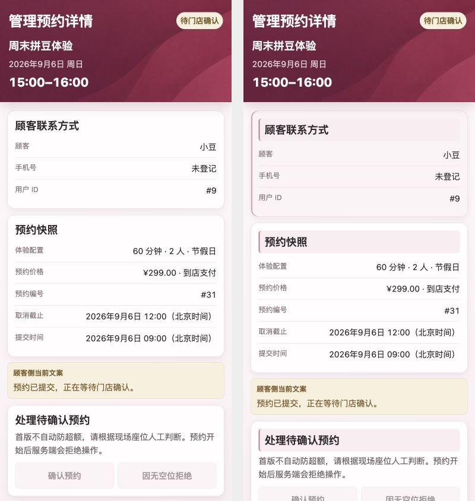
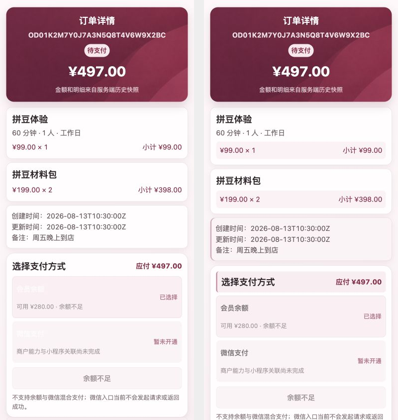
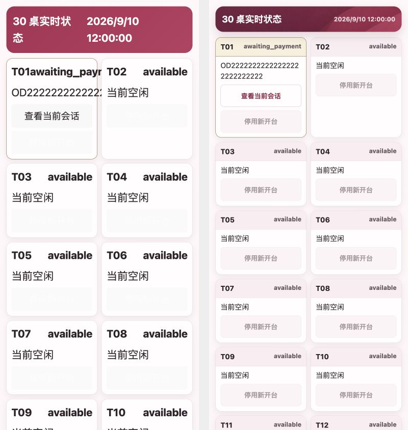
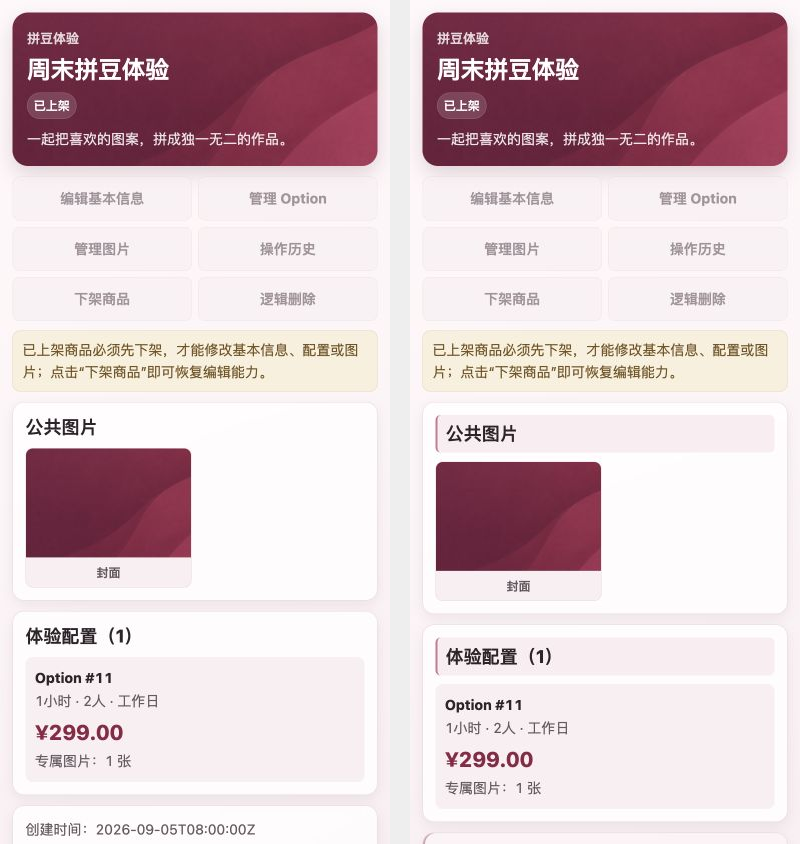

# 全页面轻量点缀巡检 · 2026-09-13

## 范围与结论

基于用户已确认的管理订单详情风格，检查 app.config.ts 全部 36 个注册路由（顾客／入口 16、管理 20）。17 个页面增加轻量点缀，19 个页面保留现有视觉。代码仅修改 14 个 SCSS 文件，没有改写页面结构、业务状态、API 或数据。

按 Product Design Audit 捕获实际页面，再依据现有目标修改。主要详情页使用同一 390 × 844、同一数据状态的前后截图并排复核。17 个修改页补查 320、390、768 宽度；320／768 共 34 次 DOM 宽度检查无横向溢出。长管理页面另捕获滚动底部。

## 逐页记录

表中图片均为本轮浏览器截图。详情和表单使用有效隔离数据；购物车、确认页同时核对空态与通过 UI 加购生成的内容态。

| 步骤 | 页面 | 结果与处理 | 截图 |
|---|---|---|---|
| 1 | 角色入口 | 正常分流至商城，保留 | [查看](../../../design-qa-assets/all-pages-accent/customer-entry-before.png) |
| 2 | 商城 | 已有纹理、筛选与商品图层次，保留 | [查看](../../../design-qa-assets/all-pages-accent/customer-index-before.png) |
| 3 | 登录 | 居中表单增加柔莓窄顶线 | [查看](../../../design-qa-assets/all-pages-accent/customer-login-after.png) |
| 4 | 注册 | 表单增加柔莓窄顶线 | [查看](../../../design-qa-assets/all-pages-accent/customer-register-after.png) |
| 5 | 商品详情 | 已有配置分区、图像和价格焦点，保留 | [查看](../../../design-qa-assets/all-pages-accent/customer-product-detail-before.png) |
| 6 | 购物车 | 空态及有商品状态均清楚，保留 | [查看](../../../design-qa-assets/all-pages-accent/customer-cart-populated.png) |
| 7 | 确认订单 | 摘要、商品与备注分区已有层次，保留 | [查看](../../../design-qa-assets/all-pages-accent/customer-order-confirm-populated.png) |
| 8 | 我的订单 | 纹理、筛选与记录卡已有层次，保留 | [查看](../../../design-qa-assets/all-pages-accent/customer-orders-before.png) |
| 9 | 顾客订单详情 | 小计浅粉底、元信息柔粉底、支付标题带；支付方式名称显式深色 | [查看](../../../design-qa-assets/all-pages-accent/customer-order-detail-after.png) |
| 10 | 新建预约 | 时间、套餐、联系方式分区清楚，保留 | [查看](../../../design-qa-assets/all-pages-accent/customer-reservation-create-before.png) |
| 11 | 我的预约 | 行动入口、筛选、记录已有层次，保留 | [查看](../../../design-qa-assets/all-pages-accent/customer-reservations-before.png) |
| 12 | 顾客预约详情 | 快照、取消改期区增加浅粉标题带 | [查看](../../../design-qa-assets/all-pages-accent/customer-reservation-detail-after.png) |
| 13 | 会员中心 | 保留已确认的订单、钱包与展开资料设计 | [查看](../../../design-qa-assets/all-pages-accent/customer-member-before.png) |
| 14 | 余额充值 | 金额区和能力提示已有层次，保留 | [查看](../../../design-qa-assets/all-pages-accent/customer-wallet-recharge-before.png) |
| 15 | 资金明细 | 流水已有细侧线与入账颜色，保留 | [查看](../../../design-qa-assets/all-pages-accent/customer-wallet-transactions-before.png) |
| 16 | 扫码开台 | 流程、商品目录、结算区已有层次，保留 | [查看](../../../design-qa-assets/all-pages-accent/customer-table-entry-before.png) |
| 17 | 店铺工作台 | 保留已确认的纹理与三组入口 | [查看](../../../design-qa-assets/all-pages-accent/admin-workbench-before.png) |
| 18 | 管理商品列表 | 恢复筛选区被阴影覆盖的细色线 | [查看](../../../design-qa-assets/all-pages-accent/admin-products-after.png) |
| 19 | 新建商品 | 原有表单顶线及页头已足够，保留 | [查看](../../../design-qa-assets/all-pages-accent/admin-product-create-before.png) |
| 20 | 管理商品详情 | 图片／配置标题带、时间元信息柔粉底 | [查看](../../../design-qa-assets/all-pages-accent/admin-product-detail-after.png) |
| 21 | 商品操作历史 | 记录卡增加柔莓细侧线 | [查看](../../../design-qa-assets/all-pages-accent/admin-product-audit-after.png) |
| 22 | 编辑商品 | 保留既有表单分区与状态提示 | [查看](../../../design-qa-assets/all-pages-accent/admin-product-edit-before.png) |
| 23 | 价格与配置 | 配置编辑、列表及套装区增加浅粉标题带 | [查看](../../../design-qa-assets/all-pages-accent/admin-product-configuration-after.png) |
| 24 | 商品图片 | 公共图片和配置图片增加标题带 | [查看](../../../design-qa-assets/all-pages-accent/admin-product-images-after.png) |
| 25 | 商品库存 | 调整区标题带、筛选区细色线，保留权威库存焦点 | [查看](../../../design-qa-assets/all-pages-accent/admin-product-inventory-after.png) |
| 26 | 管理订单列表 | 恢复筛选区细色线 | [查看](../../../design-qa-assets/all-pages-accent/admin-orders-after.png) |
| 27 | 管理订单详情 | 保留刚确认的风格，作为本轮参考 | [查看](../../../design-qa-assets/all-pages-accent/admin-order-detail-before.png) |
| 28 | 管理预约列表 | 恢复筛选区细色线，保留日历入口层次 | [查看](../../../design-qa-assets/all-pages-accent/admin-reservations-after.png) |
| 29 | 管理预约详情 | 联系方式柔粉底、快照和处理区标题带 | [查看](../../../design-qa-assets/all-pages-accent/admin-reservation-detail-after.png) |
| 30 | 店休设置 | 长期／临时安排已有清楚区分，保留 | [查看](../../../design-qa-assets/all-pages-accent/admin-store-closures-before.png) |
| 31 | 管理用户列表 | 恢复筛选区细色线 | [查看](../../../design-qa-assets/all-pages-accent/admin-users-after.png) |
| 32 | 用户资金账户 | 权威余额与操作区已有层次，保留 | [查看](../../../design-qa-assets/all-pages-accent/admin-user-wallet-before.png) |
| 33 | 代客商品扣款 | 商品目录与资金摘要已有层次，保留 | [查看](../../../design-qa-assets/all-pages-accent/admin-wallet-order-before.png) |
| 34 | 库存流水 | 筛选区增加柔莓细顶线，保留流水语义色 | [查看](../../../design-qa-assets/all-pages-accent/admin-inventory-transactions-after.png) |
| 35 | 桌台工作台 | 统一纹理页头、卡片标题和按钮；长编号安全换行 | [查看](../../../design-qa-assets/all-pages-accent/admin-tables-after.png) |
| 36 | 桌台会话 | 会话信息柔粉底、计时标题带、输入与应急按钮统一 | [查看](../../../design-qa-assets/all-pages-accent/admin-table-session-active.png) |

## 前后对照

以下图片左侧修改前、右侧修改后，均为 390 × 844、相同隔离数据。

## 验证与边界

- Stylelint、TypeScript、全量 ESLint 通过。H5 与微信 CI 构建通过；H5 保留既有构建警告。微信产物检查通过：193 文件，主包 951712 字节，分包 564616 字节，总计 1516328 字节，release_eligible=false。
- 全量 Jest：103 套件，102 通过、1 失败；794 项，793 通过、1 失败。失败为已有 `avatar_style.test.ts:31` 要求头像 `transform: translateY(-1px)`，当前会员样式不存在该偏移。本轮未改会员页面或该测试，也未修改断言掩盖失败。
- 修改页均保存 320／768 截图与 DOM 宽度记录，见截图目录 `viewport-checks.json`；390 用于正常手机布局和前后比较。
- 管理详情／图片／配置／库存／流水／预约长页补查底部；桌台会话补查待支付和体验中计时卡；购物车、确认页通过 UI 本地加购进入内容态。
- 先用内置浏览器；顾客路由出现 Taro 页面在视口外的渲染问题后转用 Chrome，重新捕获有效页面。空白截图不作为通过证据；登录／注册早期内置浏览器截图不用于同视口前后比较。
- 接口由临时只读 fixture 提供，POST 拒绝，会话为隔离样例。商品图使用既有品牌纹理作占位，仅核对图像容器与布局，不作为真实商品素材验收。
- 本轮为注册页面及代表内容态的视觉巡检，不是所有业务状态穷举、真实支付／退款、微信真机或发布验收。仅改 SCSS，未运行后端测试。截图不能证明完整无障碍符合性。

## Review Report

采用按需样式 mixin，没有全局染色所有白卡，没有覆盖成功／警告／错误语义，没有新增依赖、图像资源或动画。保留业务字段、操作入口和既有响应式分栏。本轮相对工作区基线核对样式差异，保留其他未提交工作。

文档联动：DESIGN.md 记录次级页面点缀规范，changelog 记录范围，design-qa.md 追加视觉验收。无需 API、数据库、迁移、版本或依赖变更。未提交、推送或发布。

## 资源回收

已关闭本轮 Chrome／内置浏览器预览标签并复核标签清单，恢复两个浏览器视口。只读预览服务 PID 61281 已退出，127.0.0.1:18768 监听已释放；构建、测试与检查会话均已结束。任务临时目录已删除，保留工作区截图与报告。没有接管或停止用户原有服务。
